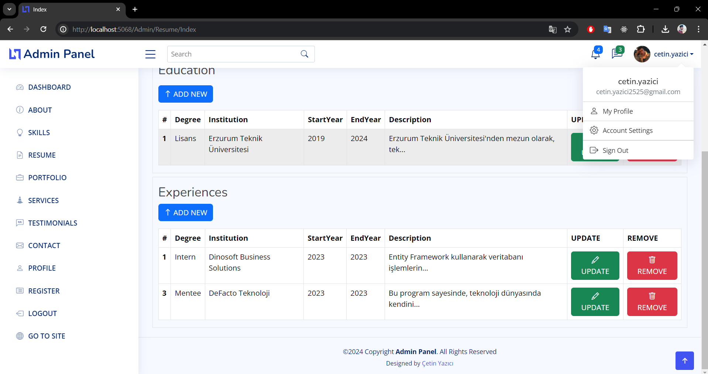
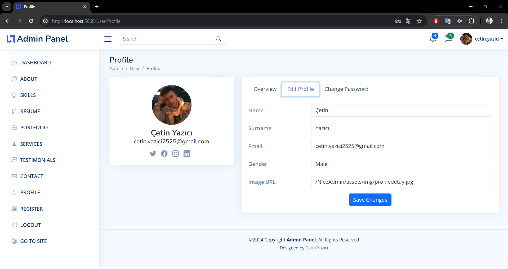

# Çetin Yazıcı Portföy Sitesi

Bu proje, yazılım geliştirme ve diğer teknik yeteneklerimi sergilemek için hazırladığım kişisel portföy sitesidir. Site, projelerim, becerilerim, özgeçmişim ve iletişim bilgilerim gibi bilgileri içermektedir.

## İçindekiler

- Özellikler
- Kullanılan Teknolojiler
- Kullanım
- Kurulum
- Proje Ekran Görüntüleri
- İletişim

## Özellikler

- **Ana Sayfa:** Kısa bir tanıtım ve yönlendirme bağlantıları.
- **Projeler:** Yaptığım projelerin listesi, detaylı açıklamaları ve bağlantıları.
- **Beceri Seti:** Sahip olduğum teknik ve sosyal beceriler.
- **Özgeçmiş:** Eğitimin, iş tecrübem ve diğer bilgilerimin yer aldığı özgeçmişim.
- **İletişim:** Bana ulaşmak için kullanılabilecek form ve sosyal medya bağlantıları.

## Kullanılan Teknolojiler

- **Backend:** C#, AspNet Core
- **Frontend:** HTML, CSS, Bootstrap, JavaScript
- **Veritabanı:** SQL Server
- **Diğer:** Identity, AutoMapper, DTO, FluentValidation

## Kullanım

1. Projeyi indirin veya klonlayın.
2. Proje dizinine gidin ve gerekli bağımlılıkları yükleyin.
3. Veritabanı bağlantı ayarlarını yapın.
4. Uygulamayı çalıştırın.

```bash
git clone https://github.com/cetinyazici/portfolio.git
cd portfolio
dotnet restore
dotnet ef database update
dotnet run
```

## Proje Ekran Görüntüleriportfolio








### İletişim

- E-posta: cetin.yazici2525@gmail.com
- LinkedIn: [cetinyazici](https://www.linkedin.com/in/cetinyazici)
- GitHub: [cetinyazici](https://github.com/cetinyazici)
